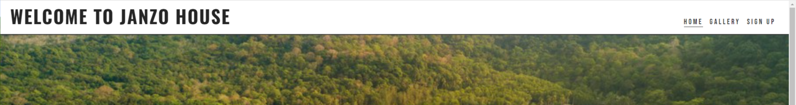
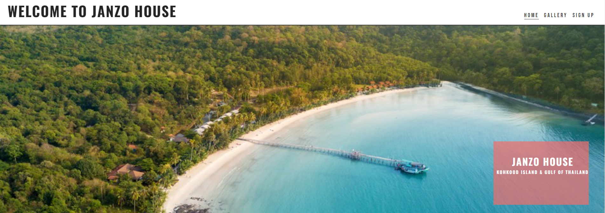
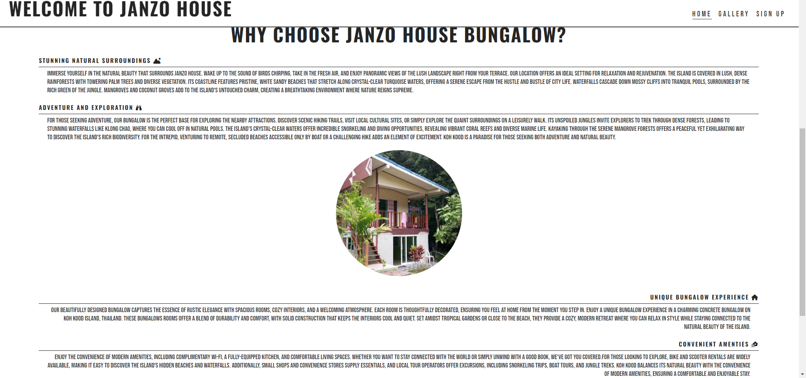
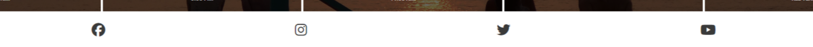

# Janzo House

Janzo House is a house room fully equiped with kitchen and bed room renting on a island of koh kood for those who want to go in holiday and have a good place to stay while they enjoy the beauty of the island.
everybody can sign up through the form application and choose between options for booking by email or for getting information to prepare the further stays.
the form is already set up to include both option: it is up to the user to decide.

In the section "why choose janzo house bungalow?" there is information for guidance of what to do and place to visit depending of the users need.
there is also a full description of the ressort for have an idea to what to expect while you prepare you holidays. 

[View Janzo House project here](https://peuks.github.io/Janzohouse/)
- - -

## Table of contents

### [User Experience (UX)](#user-experience-ux-1)
* [User Stories](#user-stories)
### [Features](#features)
* [Existing Features](#existing-features)
### [Features Left to Implement](#features-left-to-implement-1)
### [Design](#design-1)
### [Technologies Used](#technologies-used-1)
### [Frameworks, Libraries & Programs Used](#frameworks-libraries--programs-used-1)
### [Testing](#testing-1)
* [Validation Results](#validation-results)
* [Manual Testing](#manual-testing)
* [Lighthouse Report](#lighthouse-report)
### [Deployment and local development](#deployment-and-local-development-1)
* [GitHub Pages](#github-pages)
* [Forking the GitHub Repository](#forking-the-github-repository)
* [Local Clone](#local-clone)
### [Credits](#credits-1)
### [Acknowledgements](#acknowledgements-1)
---

## User Experience (UX)

This website is meant to attract people who like to go on vacation and would like find an affordable place to stay.
There is clear navigation and a form set up on the sign-up page to who want to book and get information.
Users can contact Janzo House if they wish to book or get information about the place and date.

### User Stories

 * First-time visitor goals
    * Understand the main purpose of the site and learn more about the Janzo House ressort.
    * Easily navigate throughout the site.
    * Find the Sign Up form and fill it out.
 * Returning visitor goals
    * Find out information about the ressort.
    * Locate contact information.
    * Review the site's gallery.

 * Frequent user goals
    * Review the gallery for any new photos.

## Features

* This website is targeting people who want to go on vacation and book a place for stay.
* They can do that by navigating to the sign-up page and filling out a form.
* Responsive on all device sizes.

### Existing Features

* Navigation bar
    * It is featured and fixed on all three pages and the form-received page.
    * Includes links to the logo, home page, gallery, and sign-up page.
    * It is identical in design across the pages.
    * Allows easy navigation from page to page without having to revert back to the previous page via the "back" button.

 

  * Main heading, which is the same for each page:
    * The home page is made up of " Welcome to Janzo House"
    * Gallery page is made up of " welcome to Janzo House"
    * The sign up page is comprised of "Let's get you signed up"
    * The application send received a "Thank you for contacting us".  

 

 * Section one, info
   * This section contains a short location followed by images.
   * It gives us a brief description of the location.

 

* Section two, "why choose Janzo House bungalow?"
   * This section will allow users to get information about koh kood island and  janzo house.
   * This section will allow users to get information on the needs of user for exploring.
   * information for convenient amenties
   * Show the look of the bungalow room images 

  

* Section three, information.
  
  * This section will allow users to get information about breakfast time.
  * This section will allow users to get information about check-in and late check-in.

  

* Footer
    
    * Links to the social media for Janzo House will open in a new tab to allow easy navigation for the user.
    * It is valuable to the user as it gives them an easy contact option via social media.
    * It give information for the the user about break-fast and checkin/out time.

  

* Gallery
    
    * The gallery will provide the user with supporting images to see how the rooms look and the beach.
    * This section is valuable to the user as they will see how is look like.

  

* The sign up page 
     
   * This page will allow users to choose which information needed, sign up for it.
   * The user can choose information or booking or both.

  

   * The sign up received page
   * Form received 

      
  

---

 ## Features left to Implement

   * Update gallery with additional images
      
 ---

 ## Technologies Used

   * [HTML5](https://en.wikipedia.org/wiki/HTML5) 
   * [CSS3](https://en.wikipedia.org/wiki/CSS)

   ---

 ## Frameworks, Libraries & programs used
        
   * [Gitpod](https://www.gitpod.io/)
             
   * To write the code.

   * [Github](https://github.com/)

   * Deployement of the website and storing the files online.

   * [Google fonts](https://fonts.google.com/)

   * Importe main font the website.

   * [Am I Responsive](https://ui.dev/amiresponsive)
           
   * Mockup picture for the README FILE.

 ---

   ## Testing 
          
   The W3C Markup Validator and W3C CSS validator services were used to validate every page of the project to ensure there were no errors.

   * [W3C Markup Validator](https://validator.w3.org/)
   * [W3C CSS Validator](https://jigsaw.w3.org/css-validator/)

   ### validation results

   

   
index.html
   

 
       

       

       
Sign-up.html
       

 
       

       

       
form-received.html
       

 
       

       

       
style.css
       

 
       

   ### Manual Testing

   * The website was tested on Google Chrome, Microsoft Edge, and Opera browsers.
   * The website was viewed on desktop computer, laptop, and mobile phone.
   * A large amount of testing was done to ensure links between pages are working correctly on all pages.
   * Family and friends were asked to review the website for a better understanding of the user experience.
   * Dev Tools was used to test how the site looks on various screen sizes.

   ### Lighthouse Report

 ### Mobile analysis
   

   
Home Page
   

 
      

      

      
Gallery
      

 
      

      

      
Sign Up
      

 
      

      

      
Application Received
      

 
      

  ### Desktop analysis
   

   
Home Page
   

 
      

      

      
Gallery
      

        
 
     

     

     
Sign Up
     

 
     

     

     
Application Received
     

 
     

   ---

  ## Deployment and local development   

 ### GitHub Pages
 GitHub Pages used to deploy live version of the website.
1. Log in to GitHub and locate [GitHub Repository Janzo House](https://peuks.github.io/Janzohouse/)
2. At the top of the Repository(not the main navigation) locate "Settings" button on the menu.
3. Scroll down the Settings page until you locate "GitHub Pages".
4. Under "Source", click the dropdown menu "None" and select "Main" and click "Save".
5. The page will automatically refresh.
6. Scroll back to locate the now-published site [link](https://peuks.github.io/Janzohouse/) in the "GitHub Pages" section.

### Forking the GitHub Repository

By forking the repository, we make a copy of the original repository on our GitHub account to view and change without affecting the original repository by using these steps:

1. Log in to GitHub and locate [GitHub Repository Janzo House](https://peuks.github.io/Janzohouse/)
2. At the top of the Repository(under the main navigation) locate "Fork" button.
3. Now you should have a copy of the original repository in your GitHub account.

### Local Clone

1. Log in to GitHub and locate [GitHub Repository Janzo House](https://peuks.github.io/Janzohouse/)
2. Under the repository name click "Clone or download"
3. Click on the code button, select clone with HTTPS, SSH or GitHub CLI and copy the link shown.
4. Open Git Bash
5. Change the current working directory to the location where you want the cloned directory to be made.
6. Type `git clone` and then paste The URL copied in the step 3.
7. Press Enter and your local clone will be created.

---

## Credits

### Code
 * Understanding the concept of flexbox was learned through [Complete Guide to Flexbox](https://css-tricks.com/snippets/css/a-guide-to-flexbox/)
 * The README template was helpfully provided by [Code Institute (template)](https://github.com/Code-Institute-Solutions/SampleREADME)
 
### Content

 * All content was written by the developer.
 * [Color contrast checker](https://coolors.co/contrast-checker/112a46-acc8e5) was used to decide which colors would be used for the website.

### Media 

 * [google images](https://www.bing.com/images/search?view=detailV2&ccid=jNxp%2FI1V&id=1A399036779EF42E281B3933ADC88AE7A32B0E5E&thid=OIP.jNxp_I1Vbo5T8NaMQPefQQHaE8&mediaurl=https%3A%2F%2Fwww.holidify.com%2Fimages%2FbgImages%2FKOH-KOOD.jpg&cdnurl=https%3A%2F%2Fth.bing.com%2Fth%2Fid%2FR.8cdc69fc8d556e8e53f0d68c40f79f41%3Frik%3DXg4ro%252beKyK0zOQ%26pid%3DImgRaw%26r%3D0&exph=667&expw=1000&q=koh+kood&simid=608025597440431759&FORM=IRPRST&ck=F2401248C0656477C440FFB5F1CF1F6B&selectedIndex=3&itb=0&cw=1728&ch=827&ajaxhist=0&ajaxserp=0)
---

## Acknowledgements

 * My mentor Mitko Bachvarov provided helpful feedback and a link to the Flexbox guide.
 * Slack community for encouragement and information.